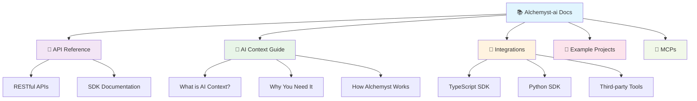

# 🧪 Alchemyst-ai Docs

<div align="center">


### 🚀 The Central Hub for All Alchemyst-ai Documentation

*Empowering developers with clear, concise, and accessible information*

[](https://github.com/Alchemyst-ai/docs/stargazers)
[](https://github.com/Alchemyst-ai/docs/network)
[](https://github.com/Alchemyst-ai/docs/graphs/contributors)

[](https://docs.getalchemystai.com/)
[](LICENSE)
[](CONTRIBUTING.md)

</div>

---

## 📑 Table of Contents

<details open>
<summary><b>🗂️ Click to navigate</b></summary>

- [🎯 Project Overview](#-project-overview)
- [✨ Features](#-features)
- [🛠️ Tech Stack](#️-tech-stack)
- [📁 Folder Structure](#-folder-structure)
- [🚀 Getting Started](#-getting-started)
  - [📋 Prerequisites](#-prerequisites)
  - [⚙️ Installation](#️-installation)
  - [🔥 Local Development](#-local-development)
- [🤝 Contributing](#-contributing)
- [📜 License](#-license)
- [💖 Acknowledgments](#-acknowledgments)

</details>

---

## 🎯 Project Overview

> **Welcome to the official documentation repository for Alchemyst-ai!** 🎉

<div align="center">



</div>

This monorepo serves as the **single source of truth** for all documentation related to our projects, APIs, and tools. We believe in the power of clear, concise, and accessible information, and this repository is our commitment to empowering our users and developers.

### 🌟 Why Choose Our Documentation?

| Feature | Description | Benefits |
|---------|-------------|----------|
| 📝 **MDX Powered** | Combines Markdown simplicity with JSX interactivity | Rich, engaging learning experience |
| 🔍 **Comprehensive** | Covers APIs, integrations, and examples | One-stop documentation hub |
| 🎨 **Modern Design** | Clean, intuitive interface | Better developer experience |
| 🚀 **Always Updated** | Continuous integration with our development cycle | Never outdated information |

---

## ✨ Features

<div align="center">

### 🎪 What Makes Our Docs Special?

</div>

<table>
<tr>
<td width="50%">

### 🔥 **Core Features**
- **📖 Interactive Documentation**: MDX-powered content with live examples
- **🔍 Advanced Search**: Find what you need instantly
- **📱 Mobile Responsive**: Perfect on any device
- **🎨 Syntax Highlighting**: Beautiful code examples
- **🔄 Auto-sync**: Always up-to-date with latest releases

</td>
<td width="50%">

### 🚀 **Developer Experience**
- **⚡ Fast Loading**: Optimized for speed
- **🎯 Easy Navigation**: Intuitive sidebar structure  
- **📋 Copy-Paste Ready**: All code examples are ready to use
- **🔗 Deep Linking**: Share specific sections easily
- **💬 Community Driven**: Contributions welcome

</td>
</tr>
</table>

---

## 🛠️ Tech Stack

<div align="center">

### 🏗️ **Built with Modern Technologies**

</div>

| Technology | Purpose | Why We Chose It |
|------------|---------|-----------------|
|  | **Content Creation** | Perfect blend of Markdown simplicity and JSX power |
|  | **Runtime Environment** | Fast, scalable JavaScript runtime |
|  | **Documentation Platform** | Modern, fast documentation generator |

<div align="center">

```bash
🎯 Performance First  •  📱 Mobile Ready  •  🎨 Developer Friendly
```

</div>

---

## 📁 Folder Structure

<details>
<summary><b>🗂️ Explore our organized structure</b></summary>

```
📦 alchemyst-ai-docs/
├── 📂 .github/                    # Community health files
│   ├── 📄 CODE_OF_CONDUCT.md
│   ├── 📄 CONTRIBUTING.md
│   └── 📄 ISSUE_TEMPLATE.md
├── 📂 developer-docs/             # 🎯 Main documentation
│   ├── 📄 README.md              # This file
│   ├── ⚙️ docs.json              # Configuration
│   ├── 🏠 index.mdx              # Homepage
│   ├── ⚡ quickstart.mdx         # Quick start guide
│   ├── 🔧 development.mdx        # Development guide
│   │
│   ├── 📂 api-reference/         # 🔌 API Documentation
│   │   ├── 📄 introduction.mdx
│   │   ├── 📄 openapi.json
│   │   └── 📂 endpoint/
│   │       └── 📂 api/v1/
│   │           └── 📂 context/
│   │               ├── ➕ add/post.mdx
│   │               ├── 🗑️ delete/post.mdx
│   │               ├── 🔍 search/post.mdx
│   │               ├── 📂 traces/{traceId}/
│   │               └── 👀 view/
│   │
│   ├── 📂 ai-context/            # 🧠 AI Context Guide
│   │   ├── 📄 what-is-ai-context.mdx
│   │   ├── 📄 why-you-need-ai-context.mdx
│   │   └── 📄 how-alchemyst-works.mdx
│   │
│   ├── 📂 essentials/            # 📚 Core Concepts
│   │   ├── 💻 code.mdx
│   │   ├── 🖼️ images.mdx
│   │   ├── ✍️ markdown.mdx
│   │   ├── 🧭 navigation.mdx
│   │   ├── 🔄 reusable-snippets.mdx
│   │   └── ⚙️ settings.mdx
│   │
│   ├── 📂 integrations/          # 🔌 Third-party Integrations
│   │   ├── 📄 introduction.mdx
│   │   ├── 📂 sdk/
│   │   │   ├── 📘 typescript-sdk.mdx
│   │   │   └── 🐍 python-sdk.mdx
│   │   └── 📂 third-party/
│   │       ├── 🤖 agnoagi/python.mdx
│   │       ├── ⚡ aisdk/js.mdx
│   │       ├── 🦜 langchain/{js,python}.mdx
│   │       └── 🦙 llamaindex/{js,python}.mdx
│   │
│   ├── 📂 example-projects/      # 💼 Real-world Examples
│   │   ├── 📄 introduction.mdx
│   │   └── 📂 team/
│   │       ├── 📚 syllabai.mdx
│   │       └── 📖 zendocs.mdx
│   │
│   ├── 📂 mcps/                  # 🔗 Model Context Protocol
│   │   ├── 📄 introduction.mdx
│   │   ├── 📄 mcps.mdx
│   │   ├── 🖱️ cursor.mdx
│   │   ├── 🤖 claude-desktop.mdx
│   │   └── 💻 visual-studio-code.mdx
│   │
│   ├── 📂 snippets/              # 🧩 Reusable Code
│   │   └── 📄 snippet-intro.mdx
│   │
│   ├── 📂 images/                # 🖼️ Visual Assets
│   ├── 📂 logo/                  # 🎨 Brand Assets
│   ├── ⚡ action.js              # Automation scripts
│   └── 🔧 ctx.js                 # Context utilities
```

</details>

---

## 🚀 Getting Started

<div align="center">

### 🎯 **Get Up and Running in Minutes!**

</div>

### 📋 Prerequisites

Before you begin, ensure you have the following installed:

```bash
# Check your Node.js version
node --version  # Should be v18 or higher ✅

# Check npm version
npm --version   # Latest version recommended ✅
```

> **💡 Pro Tip**: We recommend using [Node Version Manager (nvm)](https://github.com/nvm-sh/nvm) for managing Node.js versions.

### ⚙️ Installation

<div align="center">

**🚀 One Command Installation**

</div>

```bash
# Install Mintlify CLI globally
npm install -g mint
```

<div align="center">


</div>

### 🔥 Local Development

<div align="center">

**⚡ Start Developing in 2 Steps**

</div>

**Step 1:** Navigate to the docs directory
```bash
cd developer-docs
```

**Step 2:** Start the development server
```bash
mint dev
```

<div align="center">

🎉 **That's it!** Your documentation site will be available at:

[](http://localhost:3000)

</div>

---

## 🤝 Contributing

<div align="center">

### 🌟 **Help Us Make Documentation Better!**

*Every contribution, no matter how small, makes a difference.* 💙

</div>

<table>
<tr>
<td width="33%">

### 1️⃣ **Setup**
```bash
# Fork and clone
git clone your-fork-url
cd docs

# Create feature branch
git checkout -b docs/amazing-feature

# Install and run
mint dev
```

</td>
<td width="33%">

### 2️⃣ **Develop**
- 📝 Write in MDX format
- 🎨 Follow existing patterns
- 📂 Place in appropriate directory
- 🔄 Update `docs.json` navigation
- ✅ Test locally with `mint dev`

</td>
<td width="33%">

### 3️⃣ **Submit**
```bash
# Commit changes
git add .
git commit -m "docs(scope): description"

# Push and create PR
git push origin docs/amazing-feature
```
📬 Open PR with screenshots!

</td>
</tr>
</table>

### 🎯 **Contribution Guidelines**

<details>
<summary><b>📋 Click to see detailed guidelines</b></summary>

#### 📝 **Writing Style**
- Use clear, concise language
- Include code examples where relevant  
- Add screenshots for UI changes
- Follow MDX best practices

#### 🗂️ **File Organization**
- Place files in logical directories
- Use descriptive filenames
- Update navigation in `docs.json`
- Keep the folder structure clean

#### ✅ **Quality Checks**
- [ ] Run `mint dev` and verify rendering
- [ ] Check all links work correctly
- [ ] Ensure images load properly
- [ ] Test on mobile devices
- [ ] Proofread for typos and grammar

#### 📬 **Pull Request Process**
1. **Title**: Use format `docs(scope): brief description`
2. **Description**: Include what changed and why
3. **Screenshots**: For any visual changes
4. **Testing**: Confirm everything works locally
5. **Review**: Address feedback promptly

</details>

### 🏆 **Contributors Hall of Fame**

<div align="center">

Thanks to all our amazing contributors! 🙏

[](https://github.com/Alchemyst-ai/docs/graphs/contributors)

*Want to see your avatar here? [Make your first contribution!](CONTRIBUTING.md)*

</div>

---

## 📜 License

<div align="center">

This project is licensed under the **Creative Commons Attribution-ShareAlike 4.0** License.

[](https://creativecommons.org/licenses/by-sa/4.0/)

*See the [LICENSE](LICENSE) file for full details.*

**TL;DR**: You're free to share and adapt this content, just give credit and share under the same license! 🤝

</div>

---

## 💖 Acknowledgments

<div align="center">

### 🌟 **Special Thanks**

</div>

<table>
<tr>
<td align="center">

**🛠️ Built With**
- [Mintlify](https://mintlify.com/) - Beautiful documentation platform
- [MDX](https://mdxjs.com/) - Markdown + JSX magic
- [Node.js](https://nodejs.org/) - JavaScript runtime

</td>
<td align="center">

**👥 Community**
- Our amazing contributors
- The open source community
- Everyone who reports issues and suggests improvements

</td>
<td align="center">

**💡 Inspiration**
- Modern documentation best practices
- Developer-first approach
- Community feedback and needs

</td>
</tr>
</table>

---

<div align="center">

### 🚀 **Ready to Get Started?**

[](https://docs.getalchemystai.com/)
[](CONTRIBUTING.md)
[](https://discord.gg/alchemyst-ai)

---

**Made with ❤️ by the Alchemyst-ai Team**

*Star ⭐ this repo if you found it helpful!*

</div>