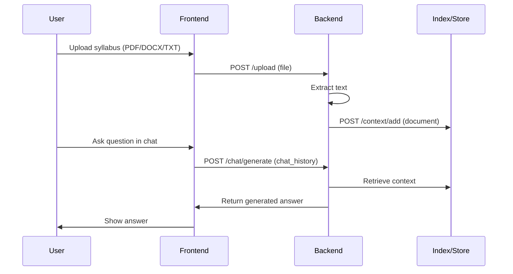
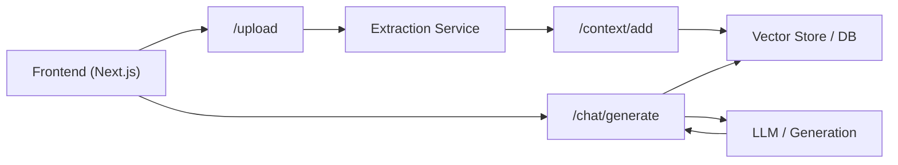
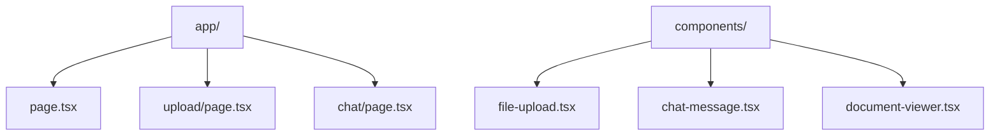
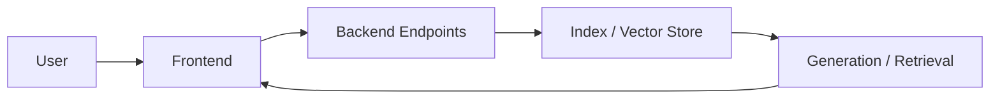
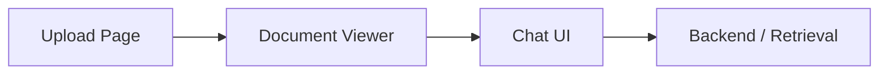

## Overview

**SyllabAI** is a starter project built with **Next.js** that helps students and instructors turn a course syllabus into an interactive study assistant. Upload a syllabus (PDF/DOCX/TXT), the platform extracts and indexes the content, and you can immediately ask questions or request summaries.



---

## Get Started

```bash
git clone https://github.com/Alchemyst-ai/SyllabAI.git
cd SyllabAI
npm install       # or: pnpm install
cp .env.example .env
npm run dev       # app starts at http://localhost:3000 (default)
```

> ⚡ After setup, upload a small test syllabus at `/upload` and visit `/chat` to interact.

---

## How It Works ?

1. **Prepare your syllabus** – Export or collect your syllabus in PDF, DOCX or TXT.
2. **Upload** – Use the Upload page to send the file to the backend extraction endpoint.
3. **Extract & Index** – Backend extracts text and adds it to a document store (or index) via `/context/add`.
4. **Ask** – Use the Chat UI to ask questions; the backend generates responses grounded in the indexed syllabus.




---

## Environment Variables

Copy `.env.example` → `.env` and set at minimum:

```bash
NEXT_PUBLIC_BACKEND_URL=https://your-backend.example.com
NEXT_PUBLIC_API_KEY=your_api_key_here
# Optional: configure timeouts, storage endpoints, and dev ports
```

> ⚠️ Keep keys and secrets out of version control.

---

## Code Structure

```
Root Directory
├── app/                 # Next.js app (pages & routes)
│   ├── page.tsx         # Landing
│   ├── upload/page.tsx  # Upload UI and client-side flow
│   └── chat/page.tsx    # Chat UI and message handling
├── components/          # Reusable UI components
│   ├── file-upload.tsx
│   ├── chat-message.tsx
│   └── document-viewer.tsx
├── lib/                 # Utility helpers
├── public/              # Static assets
├── styles/              # Tailwind / CSS
├── package.json         # Scripts & dependencies
└── README.md            # Project README
```



---

## Architecture & Flow

SyllabAI is organized into four main modules: **Frontend**, **Backend (integration)**, **Storage / Indexing**, and **Configuration**.

### 1. Frontend

Handles uploads, interactions, and rendering.

**Key files**:
- `app/upload/page.tsx` — file upload, validation, and `/upload` call
- `app/chat/page.tsx` — chat UI, fetch document, send `chat_history`
- `components/*` — UI primitives (file upload, message, viewer)

### 2. Backend (integration)

The frontend relies on a backend to perform extract, index, and generate operations. The backend can be any service that implements the expected endpoints and authorization.

**Expected endpoints**:
- `POST /upload` — Accepts multipart/form-data (file), returns `{ text }`.
- `POST /context/add` — Accepts documents payload to index/store content.
- `POST /chat/generate` — Accepts a `chat_history` and returns a generated response object.

### 3. Storage / Indexing

Indexing can be as simple as storing raw documents in a database or more advanced using vector embeddings and a vector store for retrieval-augmented generation.

### 4. Configuration

Environment variables and API keys configure the backend endpoints, auth, and optional storage settings.



---

## Core Features

- Upload PDF / DOCX / TXT syllabus files
- Extract and index content for retrieval
- Chat UI that answers questions grounded in the syllabus
- Modular frontend that can work with different backends



---

## API Endpoints

### Documents

- POST `/upload` — Upload a file (FormData) and receive extracted text `{ "text": "..." }`.
- POST `/context/add` — Add documents for indexing: `{ documents: [{ content, fileName, fileType, fileSize, name }], source, context_type }`.

### Chat

- POST `/chat/generate` — Generate an assistant response from `chat_history` and options. The UI expects response content at `result.response.kwargs.content`.

---

## Example HTTP requests

Here are concrete examples you can use when testing or building a compatible backend.

1) Upload (curl)

```bash
curl -X POST "$NEXT_PUBLIC_BACKEND_URL/upload" \
    -H "Authorization: Bearer $NEXT_PUBLIC_API_KEY" \
    -F "file=@/path/to/syllabus.pdf"
```

Expected (mock) response:

```json
{ "text": "This is mock extracted text from syllabus.pdf" }
```

2) Context add (curl)

```bash
curl -X POST "$NEXT_PUBLIC_BACKEND_URL/context/add" \
    -H "Content-Type: application/json" \
    -H "Authorization: Bearer $NEXT_PUBLIC_API_KEY" \
    -d '{ "documents": [{ "content": "<extracted text>", "fileName": "syllabus.pdf", "name": "Intro to CS" }], "source": "user-upload", "context_type": "resource" }'
```

Expected response:

```json
{ "success": true, "documentId": "doc_12345" }
```

3) Chat generate (curl)

```bash
curl -X POST "$NEXT_PUBLIC_BACKEND_URL/chat/generate" \
    -H "Content-Type: application/json" \
    -H "Authorization: Bearer $NEXT_PUBLIC_API_KEY" \
    -d '{ "chat_history": [{ "type": "human", "id": "1", "lc_kwargs": { "content": "What are the grading policies?" } }] }'
```

Expected (mock) response shape (frontend expects assistant content at result.response.kwargs.content):

```json
{
    "result": {
        "response": {
            "kwargs": {
                "content": "The grading policy is: Assignments 40%, Midterm 30%, Final 30%."
            }
        }
    }
}
```

---

---

## Troubleshooting

- 400/401 errors: verify `NEXT_PUBLIC_BACKEND_URL` and `NEXT_PUBLIC_API_KEY`.
- Empty chat responses: ensure the document was added via `/context/add` and the backend returns embeddings or indexed content.
- Upload parsing errors: check backend logs for file parser issues (unsupported PDF structure or encoding).

---

## How to run & deploy

### Run locally

```bash
npm install
npm run dev       # development server
npm run build
npm run start     # production
```

### Testing

- Upload a short syllabus (~1–3 pages) and ask a few questions in the chat UI.
- Optionally add unit/integration tests for upload and chat API integrations.

---

## Security & Best Practices

- Keep API keys secret and use server-side auth where possible.
- Validate and sanitize uploads server-side to prevent malicious files.
- Rate-limit generation endpoints and monitor usage.

---

## Benefits

1. Fast to set up and test — a minimal frontend that integrates with any compatible backend.
2. Focused UX for syllabus-driven learning.
3. Easily extensible — swap or enhance the backend for improved retrieval and generation.

---

<Card
    title="Github"
    icon="github"
    href="https://github.com/Alchemyst-ai/SyllabAI"
    horizontal
    target="_blank"
>
  Star and look at the code
</Card>
