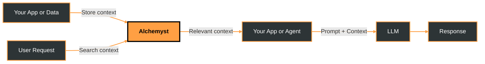

## Overview

Alchemyst is the **context layer for LLMs and AI agents**.  
It helps you store, retrieve, and apply context so AI systems stay accurate, relevant, and consistent over time.

If you’ve ever struggled with:
- Stateless LLM responses  
- Prompt stuffing  
- Fragile RAG pipelines  
- Agents that forget users or past actions  

Alchemyst is built to solve exactly that.

## What problem does Alchemyst solve?

Large language models don’t remember anything by default.

Every request starts from scratch unless you:
- Manually inject context  
- Rebuild memory systems  
- Orchestrate retrieval logic yourself  

This quickly becomes brittle, expensive, and hard to scale.

**Alchemyst makes context a first-class system capability.**

## What is Alchemyst?

Alchemyst is a **developer-first platform for AI context management**.

It gives you a reliable way to:
- Store application, user, and workflow context as raw facts
- Retrieve the most relevant information based on query
- Feed that context into LLMs and agents

All without writing custom memory or retrieval infrastructure.

## What you can do with Alchemyst

- **Persist memory across sessions**  
  Give agents long-term memory without prompt hacks.

- **Retrieve relevant context on demand**  
  Search and fetch only what matters for a given request.

- **Build reliable AI agents**  
  Create agents that behave consistently and deterministically.

- **Scale from prototype to production**  
  Use the same system for experiments, products, and enterprise workloads.

## Why use Alchemyst instead of rolling your own?

- **Cleaner architecture** – No custom vector plumbing or brittle glue code  
- **Better AI outputs** – Models respond using relevant, grounded context  
- **Faster development** – Official SDKs for Python and TypeScript  
- **Production-ready** – Built for real workloads, not demos  

## How Alchemyst works

Alchemyst sits between your data and your LLM.

## The flow is simple

**Ingest context**  
Store data from users, files, APIs, or application events.

**Index and organize**  
Context is structured for fast, relevant retrieval.

**Search when needed**  
Retrieve only the most useful context for a request.

**Use with LLMs or agents**  
Pass retrieved context into prompts or agent logic.

**Persist and evolve**  
Update memory as users and workflows change.

## Who is this for?

Alchemyst is built for:
- Developers building AI agents  
- Teams shipping LLM-powered products  
- Engineers tired of fragile context pipelines  

If you’re building with LLMs in production, you’re in the right place.

## Why Alchemyst?

Most AI systems break as context grows. We don’t.

Alchemyst operates at the Pareto frontier — higher reliability without sacrificing capability.

- **Memory isn’t text** - We store information as structured facts, modeled as connected nodes at ingestion.
- **LLMs aren’t the core** - They reason over resolved context, but never own state or truth.
- **Context is deterministic** - No bloated prompts, no token juggling, no surprise amnesia.
- **Built for production** - Stable, inspectable context that holds up beyond demos.

---

## Next steps

Start with the fastest path to value:

- [**Quick Start**](quickstart) – Store and reuse context in minutes  
- [**Cookbooks & Examples**](example-projects/team/syllabai) – Real projects built by the community  
- [**Concepts**](ai-context/what-is-ai-context) – Learn more about context, memory, and alchemyst

When you’re ready, head to the **Quick Start** and build your first context-aware application.
{/* 
https://chatgpt.com/share/694ef6b1-d9d4-8007-8dc2-e43ee026f30e

https://claude.ai/share/d38d4088-6cff-407b-848c-6ce96cc89c8a

https://gemini.google.com/share/c3c89a2e40bf */}

